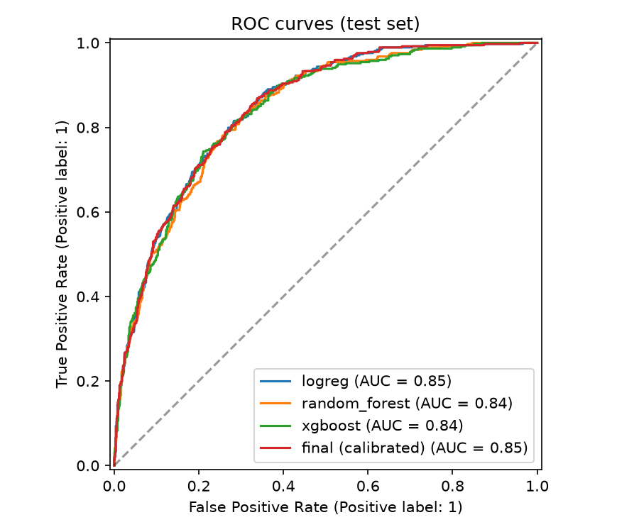
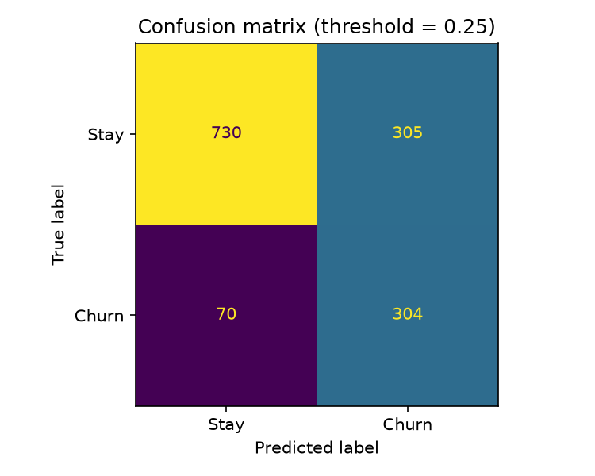
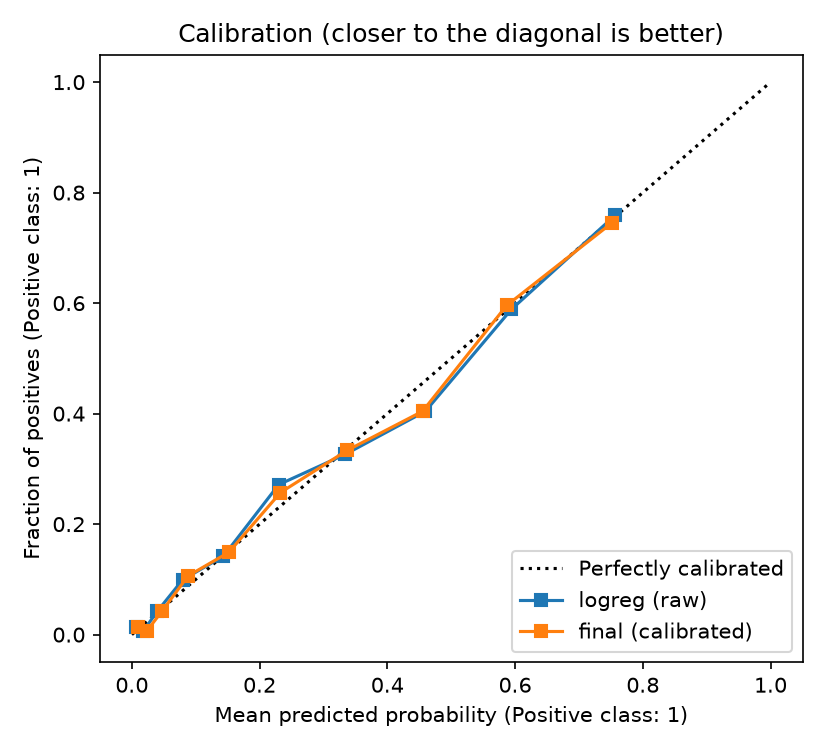
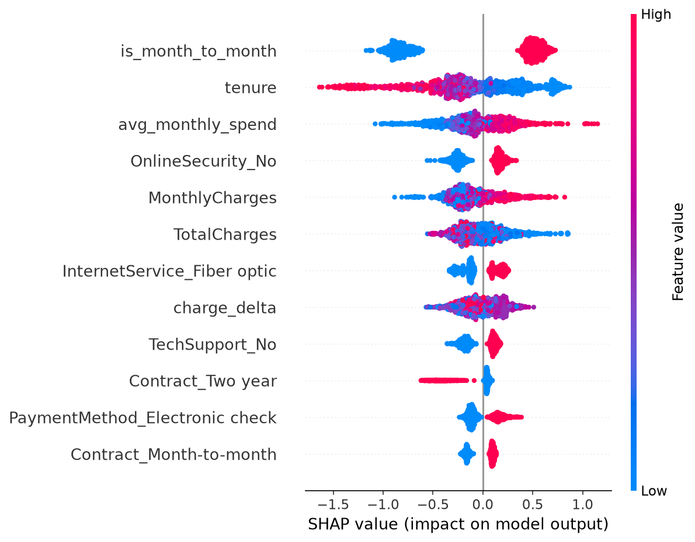

# Customer Churn Prediction

Predicts which telecom customers are likely to leave, so a retention team can contact the highest-risk customers first.

## Data
IBM Telco Customer Churn dataset (Kaggle, `blastchar/telco-customer-churn`): 7,043 customers, 20 columns, churn rate 26.5%.
Churn means the customer left within the last month (`Churn = Yes`).

## Approach
1. **Cleaning:** blank `TotalCharges` (brand-new customers) set to 0; target converted to 0/1; categorical columns one-hot encoded; numeric columns scaled.
2. **Outliers:** checked with the 1.5 x IQR rule on training data. `tenure`, `MonthlyCharges`, `TotalCharges` and `avg_monthly_spend` have none; `charge_delta` has 323 values (7.6%), which are capped inside the model pipeline (bounds learned on training data only).
3. **Features:** `num_services`, `avg_monthly_spend`, `charge_delta` (current vs. historical monthly charge, a price-change signal), `is_month_to_month`, `is_new_customer`, `auto_pay`, `has_internet`.
4. **Models:** Logistic Regression, Random Forest, XGBoost, each trained plain and with class-imbalance weighting (`*_weighted`).
5. **Split:** stratified 60/20/20 train/validation/test. Models are compared on validation; the test set is used once for the final numbers.
6. **Final model:** best validation ROC-AUC (Logistic Regression), wrapped in sigmoid calibration and trained on train + validation.
7. **Threshold:** chosen from out-of-fold predictions to minimise expected cost, assuming a missed churner costs 3x a wasted retention offer (`COST_FN`, `COST_FP` in `src/churn_pipeline.py`).
8. **Ranked list and reasons:** every customer is scored by a model that never saw them (out-of-fold for train/validation customers, the final model for test customers). SHAP values from XGBoost give the top reasons to review for each customer. Customers are split into risk tiers: top 10% critical, next 20% high.

## Results

Validation set (threshold 0.5):

| Model | ROC-AUC | PR-AUC | Precision | Recall | F1 | Brier |
|---|---|---|---|---|---|---|
| Logistic Regression | 0.839 | 0.651 | 0.678 | 0.529 | 0.595 | 0.137 |
| Logistic Regression (weighted) | 0.839 | 0.651 | 0.514 | 0.778 | 0.619 | 0.166 |
| Random Forest | 0.836 | 0.642 | 0.663 | 0.500 | 0.570 | 0.138 |
| Random Forest (weighted) | 0.836 | 0.637 | 0.529 | 0.773 | 0.628 | 0.160 |
| XGBoost | 0.834 | 0.646 | 0.661 | 0.500 | 0.569 | 0.140 |
| XGBoost (weighted) | 0.834 | 0.637 | 0.513 | 0.749 | 0.609 | 0.162 |

Held-out test set, final model at the alert threshold of 0.25:

| ROC-AUC | PR-AUC | Precision | Recall | F1 | Brier |
|---|---|---|---|---|---|
| 0.846 | 0.654 | 0.499 | 0.813 | 0.619 | 0.136 |

43.2% of test customers are flagged. The overall churn rate is 26.5%, so flagged customers churn about 1.9 times as often as an average customer.

How the cost assumption changes the alert list (test set):

| Missed churner : wasted offer | Threshold | Flagged | Precision | Recall |
|---|---|---|---|---|
| 1:1 | 0.51 | 19.7% | 0.669 | 0.497 |
| 2:1 | 0.32 | 36.4% | 0.542 | 0.743 |
| 3:1 (used) | 0.25 | 43.2% | 0.499 | 0.813 |
| 5:1 | 0.19 | 50.6% | 0.466 | 0.888 |
| 10:1 | 0.08 | 66.8% | 0.383 | 0.963 |

Notes:
- All three model families score almost the same (ROC-AUC 0.834 to 0.839), so the simpler, more interpretable Logistic Regression was selected.
- Class weighting did not improve ranking quality (same ROC-AUC); it only raises recall at the 0.5 cut-off and makes the probabilities less accurate (Brier 0.137 to 0.166). Imbalance is therefore handled by tuning the decision threshold rather than by weighting.
- Sigmoid calibration did not change the Brier score (0.136 before and after), because Logistic Regression is already well calibrated. It is kept as a safeguard.
- The cost ratio is an assumption, not a measured business figure. A lower ratio flags fewer customers; the table above shows the trade-off. Teams with limited capacity can start with the critical tier.
- Customers are most often flagged for: month-to-month contract, short tenure, and charge-related features.






## How to run
```bash
pip install -r ../requirements.txt
# place the dataset at data/telco_churn.csv
python src/churn_pipeline.py      # trains, evaluates, writes outputs/
python src/make_plots.py          # ROC, confusion matrix, calibration, SHAP plots
streamlit run app.py              # dashboard, including live scoring of a new customer
```

## Outputs
- `outputs/model_comparison.csv`: validation metrics
- `outputs/high_risk_customers.csv`: ranked customers with probability, tier and review reasons
- `outputs/cost_sensitivity.csv`, `outputs/outlier_check.csv`, `outputs/results_summary.md`
- `outputs/churn_model.joblib`: saved model and threshold (used by the dashboard)

## Limitations
- One public dataset with no time dimension, so drift over time cannot be checked.
- The Telco data has no usage-trend or support-contact columns; billing and service features are used as proxies.
- The cost ratio is assumed.
- Outliers are only capped in five continuous columns; categorical data was not audited beyond encoding.